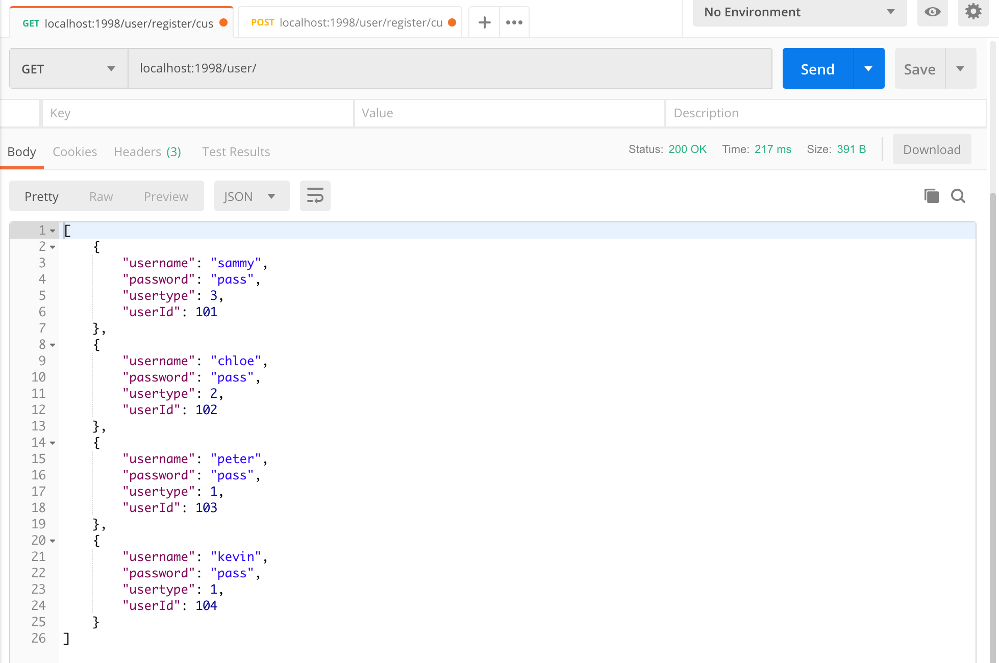
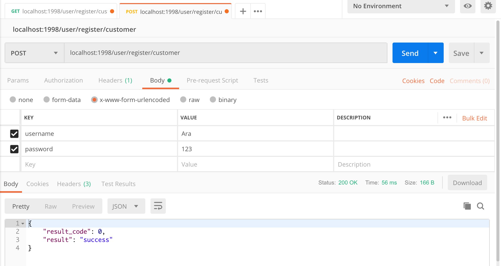
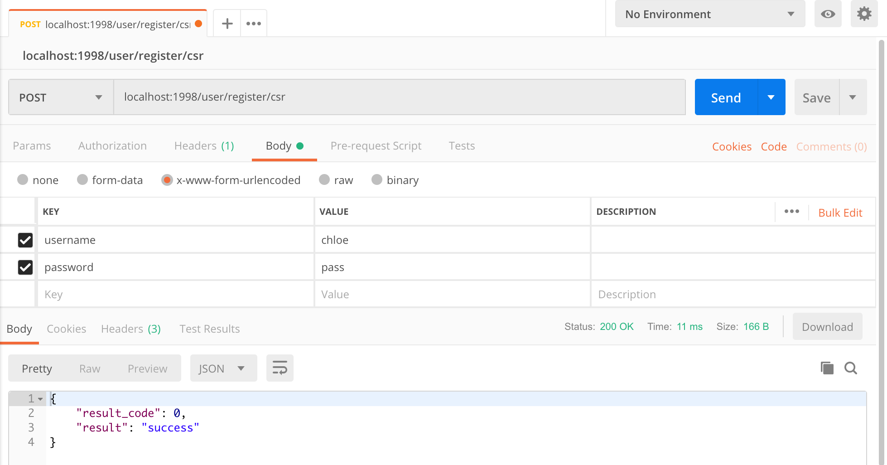
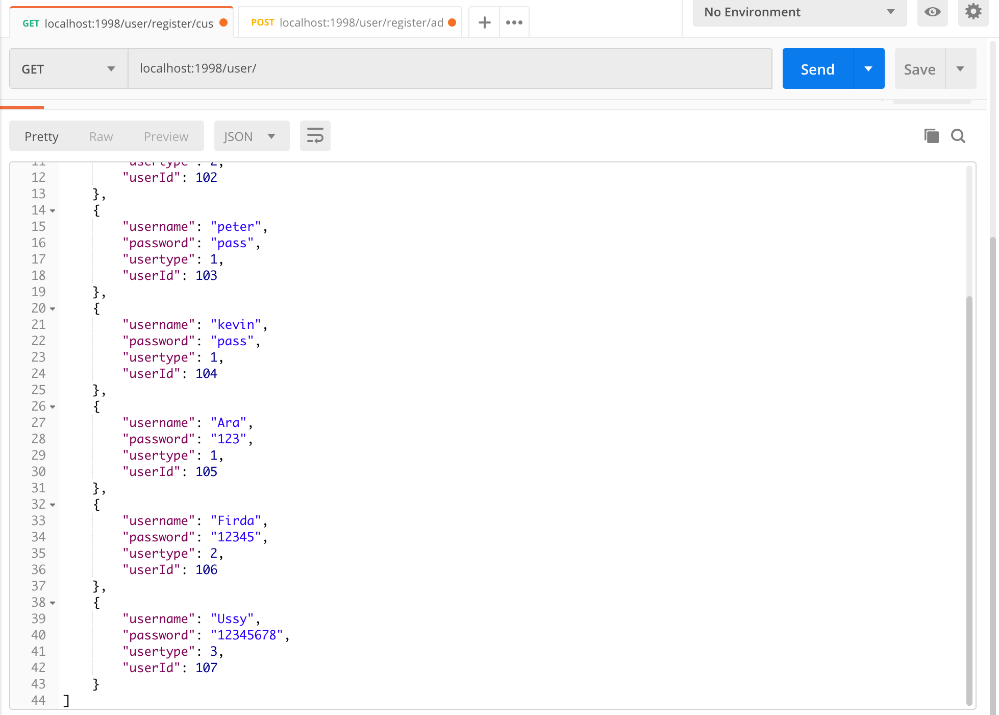

# Ticket Management System using Advanced CRUD Operations
Tutorial by [Building RESTful Web Services with Spring 5](https://books.google.co.id/books?id=stRJDwAAQBAJ&printsec=frontcover&dq=Building+RESTful+Web+Services+with+Spring+5&hl=id&sa=X&ved=0ahUKEwipsMyzlejhAhWGr48KHekwCVEQ6AEIKTAA#v=onepage&q=Building%20RESTful%20Web%20Services%20with%20Spring%205&f=false) | [Github](https://github.com/PacktPublishing/Building-RESTful-Web-Services-with-Spring-5-Second-Edition/tree/master/Chapter13)

## Description
* There are three types of user:

    | Name | User type |
    | --- | --- |
    | Customer/ General user | 1 |
    | Customer Service Representative (CSR) | 2 |
    | Admin | 3 | 

* This application has usual CRUD operations with the following rules:
  * Creating a ticket by Customer
  * Updating the ticket by all users
  * Single deleting ticket by Customer
  * Multiple deleting tickets by CSR and Admin
  
## Step 1: Registration
1.  Add **password** and **usertype** fields in the existing **User POJO**. Then, add the **userCounter** variable that will be incremented, so we can assign it as **userid** for each new user.
    ```java
    public class User {
        private Integer userid;
        private String username;
        private String password;
        private Integer usertype;
        /*
        * usertype:
        * 1 - general user
        * 2 - CSR (Customer Service Representative)
        * 3 - admin
        */
        private static Integer userCounter = 100;
        
        public User(String username, String password, Integer usertype) {
            userCounter++;
            this.userid = userCounter;
            this.username = username;
            this.password = password;
            this.usertype = usertype;
        }

        // setter and getter
    }
    ```
2. Add **register** methods for each user in the existing **UserController**.
   * Customer registration
        ```java
        // REGISTER
        // Customer registration
        @ResponseBody
        @RequestMapping(value = "/register/customer", method = RequestMethod.POST)
        public Map<String, Object> registerCustomer(
                @RequestParam(value = "username") String username,
                @RequestParam(value = "password") String password
            ) {
            userService.createUser(username, password, 1);
            return Util.getSuccessResult();
        }
        ```
   * CSR registration
        ```java
        // CSR registration
        @ResponseBody
        @RequestMapping(value = "/register/csr", method = RequestMethod.POST)
        public Map<String, Object> registerCSR(
                @RequestParam(value = "username") String username,
                @RequestParam(value = "password") String password
            ) {
            userService.createUser(username, password, 2);
            return Util.getSuccessResult();
        }
        ```
   * Admin registration
        ```java
        // Admin registration
        @ResponseBody
        @RequestMapping(value = "/register/admin", method = RequestMethod.POST)
        public Map<String, Object> registerAdmin(
                @RequestParam(value = "username") String username,
                @RequestParam(value = "password") String password
            ) {
            userService.createUser(username, password, 3); 
            return Util.getSuccessResult();
        }
        ```
3. Check it using **postman**.
   * Existing user

        

   * Customer registration

        

   * CSR registration

        

   * Admin registration

        

   * Check registered user

        


## Step 2: Login and Token Management
1. Use the existing **SecurityService** and **SecurityServiceImpl** to create token for login.
2. Add **login** methods for each user in the existing **UserController**.
   * Login as Customer
        ```java
        // LOGIN
        // Login as customer
        @ResponseBody
        @RequestMapping(value = "/login/customer", method = RequestMethod.POST)
        public Map<String, Object> loginCustomer(			
                @RequestParam(value = "username") String username,
                @RequestParam(value = "password") String password
            ) {
            User user = userService.getUser(username, password, 1);
            if(user == null){
                return Util.getUserNotAvailableError();
            }

            String subject = user.getUserId() + "=" + user.getUsertype();
            String token = securityService.createToken(subject, (15 * 1000 * 60)); // 15 mins expiry time
            
            return Util.getSuccessResult(token);
        }
        ```
   * Login as CSR
        ```java
        // Login as CSR
        @ResponseBody
        @RequestMapping(value = "/login/csr", method = RequestMethod.POST)
        public Map<String, Object> loginCSR(			
                @RequestParam(value = "username") String username,
                @RequestParam(value = "password") String password
            ) {
            User user = userService.getUser(username, password, 2);
            if(user == null){
                return Util.getUserNotAvailableError();
            }
            
            String subject = user.getUserId() + "=" + user.getUsertype();
            String token = securityService.createToken(subject, (15 * 1000 * 60)); // 15 mins expiry time
            
            return Util.getSuccessResult(token);
        }
        ```
   * Login as Admin
        ```java
        // Login as Admin
        @ResponseBody
        @RequestMapping(value = "/login/admin", method = RequestMethod.POST)
        public Map<String, Object> loginAdmin(			
                @RequestParam(value = "username") String username,
                @RequestParam(value = "password") String password
            ) {
            User user = userService.getUser(username, password, 3);
            if(user == null){
                return Util.getUserNotAvailableError();
            }
            
            String subject = user.getUserId() + "=" + user.getUsertype();
            String token = securityService.createToken(subject, (15 * 1000 * 60)); // 15 mins expiry time
            
            return Util.getSuccessResult(token);
        }
        ```
## Step 3: Ticket Management
1. Create a **Ticket POJO**.
    ```java

    ```


