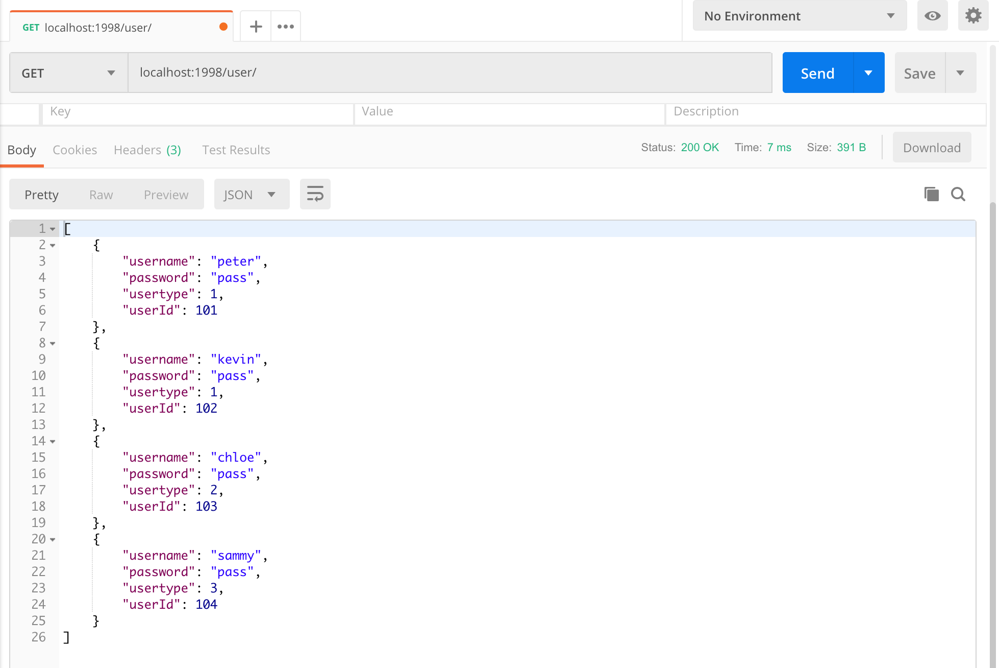

# Ticket Management System using Advanced CRUD Operations
Tutorial by [Building RESTful Web Services with Spring 5](https://books.google.co.id/books?id=stRJDwAAQBAJ&printsec=frontcover&dq=Building+RESTful+Web+Services+with+Spring+5&hl=id&sa=X&ved=0ahUKEwipsMyzlejhAhWGr48KHekwCVEQ6AEIKTAA#v=onepage&q=Building%20RESTful%20Web%20Services%20with%20Spring%205&f=false) | [Github](https://github.com/PacktPublishing/Building-RESTful-Web-Services-with-Spring-5-Second-Edition/tree/master/Chapter13)

## Description
* There are three types of user:

    | Name | User type |
    | --- | --- |
    | Customer/ General user | 1 |
    | Customer Service Representative (CSR) | 2 |
    | Admin | 3 | 

* This application has CRUD operations with the following rules:
  * Create a ticket
    * Customer
  * Read/ view  ticket
    * Customer can view their tickets in **total** or as a **single** ticket
    * CSR and Admin can view **all tickets** or **single** ticket by its ID
  * Update ticket 
    * Customer can only update the **content** of ticket
    * CSR and Admin can update the **content**, **severity**, and **status** of ticket
  * Delete ticket
    * Customer can only delete **one ticket at a time**
    * CSR and Admin can **multi-delete tickets**
      * CSR can only delete **three tickets at once**
      * Admin can delete **any number of tickets at once**
  
## 1. User Registration
1.  Add **password** and **usertype** fields in the existing **User POJO**. Then, add the **userCounter** variable that will be incremented, so we can assign it as **userid** for each new user.
    ```java
    public class User {
        private Integer userid;
        private String username;
        private String password;
        private Integer usertype;
        /*
        * usertype:
        * 1 - general user
        * 2 - CSR (Customer Service Representative)
        * 3 - admin
        */
        private static Integer userCounter = 100;
        
        public User(String username, String password, Integer usertype) {
            userCounter++;
            this.userid = userCounter;
            this.username = username;
            this.password = password;
            this.usertype = usertype;
        }

        // setter and getter
    }
    ```
2. Add **register** methods for each user in the existing **UserController**.
   * Customer registration
        ```java
        // REGISTER
        // Customer registration
        @ResponseBody
        @RequestMapping(value = "/register/customer", method = RequestMethod.POST)
        public Map<String, Object> registerCustomer(
                @RequestParam(value = "username") String username,
                @RequestParam(value = "password") String password
            ) {
            userService.createUser(username, password, 1);
            return Util.getSuccessResult();
        }
        ```
   * CSR registration
        ```java
        // CSR registration
        @ResponseBody
        @RequestMapping(value = "/register/csr", method = RequestMethod.POST)
        public Map<String, Object> registerCSR(
                @RequestParam(value = "username") String username,
                @RequestParam(value = "password") String password
            ) {
            userService.createUser(username, password, 2);
            return Util.getSuccessResult();
        }
        ```
   * Admin registration
        ```java
        // Admin registration
        @ResponseBody
        @RequestMapping(value = "/register/admin", method = RequestMethod.POST)
        public Map<String, Object> registerAdmin(
                @RequestParam(value = "username") String username,
                @RequestParam(value = "password") String password
            ) {
            userService.createUser(username, password, 3); 
            return Util.getSuccessResult();
        }
        ```
3. Create **Util** class to define some methods to give response of request. It can avoid code duplication in our application.
    ```java
    public class Util {
        public static <T> T getUserNotAvailableError(){
            Map<String, Object> map = new LinkedHashMap<>();
            map.put("result_code", 501);
            map.put("result", "User Not Available");			
            return (T) map;
        }
        
        public static <T> T getSuccessResult(){
            Map<String, Object> map = new LinkedHashMap<>();
            map.put("result_code", 0);
            map.put("result", "success");			
            return (T) map;
        }
        
        public static <T> T getSuccessResult(Object obj){
            Map<String, Object> map = new LinkedHashMap<>();
            map.put("result_code", 0);
            map.put("result", "success");
            map.put("value", obj);
            return (T) map;
        }
    }
    ```
4. Let's check the API using **postman**.
   * Customer registration

        

   * CSR registration

        

   * Admin registration

        

   * Check all users

        

## Login and Token Management
1. Use the existing **SecurityService** and **SecurityServiceImpl** to create token for login.
2. Add **login** methods for each user in the existing **UserController**.
   * Login as Customer
        ```java
        // LOGIN
        // Login as customer
        @ResponseBody
        @RequestMapping(value = "/login/customer", method = RequestMethod.POST)
        public Map<String, Object> loginCustomer(			
                @RequestParam(value = "username") String username,
                @RequestParam(value = "password") String password
            ) {
            User user = userService.getUser(username, password, 1);
            if(user == null){
                return Util.getUserNotAvailableError();
            }

            String subject = user.getUserId() + "=" + user.getUsertype();
            String token = securityService.createToken(subject, (15 * 1000 * 60)); // 15 mins expiry time
            
            return Util.getSuccessResult(token);
        }
        ```
   * Login as CSR
        ```java
        // Login as CSR
        @ResponseBody
        @RequestMapping(value = "/login/csr", method = RequestMethod.POST)
        public Map<String, Object> loginCSR(			
                @RequestParam(value = "username") String username,
                @RequestParam(value = "password") String password
            ) {
            User user = userService.getUser(username, password, 2);
            if(user == null){
                return Util.getUserNotAvailableError();
            }
            
            String subject = user.getUserId() + "=" + user.getUsertype();
            String token = securityService.createToken(subject, (15 * 1000 * 60)); // 15 mins expiry time
            
            return Util.getSuccessResult(token);
        }
        ```
   * Login as Admin
        ```java
        // Login as Admin
        @ResponseBody
        @RequestMapping(value = "/login/admin", method = RequestMethod.POST)
        public Map<String, Object> loginAdmin(			
                @RequestParam(value = "username") String username,
                @RequestParam(value = "password") String password
            ) {
            User user = userService.getUser(username, password, 3);
            if(user == null){
                return Util.getUserNotAvailableError();
            }
            
            String subject = user.getUserId() + "=" + user.getUsertype();
            String token = securityService.createToken(subject, (15 * 1000 * 60)); // 15 mins expiry time
            
            return Util.getSuccessResult(token);
        }
        ```
3. Let's check the API using **postman**.
   * Login as Customer

        

   * Login as CSR

        

   * Login as Admin  

        

   * Add **token** field in the **header**, then enter all created tokens to that field.

        

## Ticket Management
1. Create a **Ticket POJO**. Same as before, add the **ticketCounter** variable that will be incremented, so we can assign it as **ticketid** for each new ticket.
    ```java
    public class Ticket {
        private Integer ticketid;
        private Integer creatorid;
        private Date createdat;
        private String content;
        private Integer severity;
        private Integer status;

        private static Integer ticketCounter = 300;
        
        public Ticket(Integer creatorid, Date createdat, String content, Integer severity, Integer status) {
            ticketCounter++;
            this.ticketid = ticketCounter;
            this.creatorid = creatorid;
            this.createdat = createdat;
            this.content = content;
            this.severity = severity;
            this.status = status;
        }

        // setter and getter

        @Override
        public String toString() {
            return "Ticket [ticketid=" + ticketid + ", creatorid=" + creatorid
                    + ", createdat=" + createdat + ", content=" + content
                    + ", severity=" + severity + ", status=" + status + "]";
        }
	}
    ```
2. Create an interface class named **TicketService** for abstract methods. 
    ```java
    public interface TicketService {
        // READ
        List<Ticket> getAllTickets();
        List<Ticket> getMyTickets(Integer creatorid);
        Ticket getTicket(Integer creatorid, Integer ticketid);
        Ticket getTicket(Integer ticketid);
        
        // CREATE
        void addTicket(Integer creatorid, String content, Integer severity, Integer status);	
        
        // UPDATE
        void updateTicket(Integer ticketid, String content, Integer severity, Integer status);
        
        // DELETE
        void deleteMyTicket(Integer userid, Integer ticketid);
        void deleteTickets(User user, String ticketids);
    }
    ```
3. Create **TicketServiceImpl** that implements **TicketService** interface class.
    ```java
    public class TicketServiceImpl implements TicketService {
        @Autowired
        UserService userService;

        // Dummy tickets
        public static List<Ticket> tickets;

        public TicketServiceImpl() {
            tickets = new LinkedList<>();
            /*
            tickets.add(new Ticket(101, new Date(), "Login is not working", 5, 1));
            tickets.add(new Ticket(101, new Date(), "Submit button is not working", 5, 1));
            tickets.add(new Ticket(102, new Date(), "Registration is not working", 5, 1));
            */
        }
        ...
    ```
   * Read/view ticket
        ```java
            ...
            // READ
            // Get all tickets
            @Override
            public List<Ticket> getAllTickets() {
                return tickets;
            }
            // Get my ticket
            @Override
            public List<Ticket> getMyTickets(Integer creatorid) {		
                return tickets.stream()
                        .filter(x -> x.getCreatorid().intValue() == creatorid.intValue())				
                        .collect(Collectors.toList());
            }
            // Get ticket by creator ID and ticket ID
            @Override
            public Ticket getTicket(Integer creatorid, Integer ticketid) {
                return tickets.stream()
                        .filter(x -> x.getCreatorid().intValue()  == creatorid.intValue() && x.getTicketid().intValue() == ticketid.intValue())
                        .findAny()
                        .orElse(null);
            }
            // Get ticket by ticket ID
            @Override
            public Ticket getTicket(Integer ticketid) {
                return tickets.stream()
                        .filter(x -> x.getTicketid().intValue() == ticketid.intValue())
                        .findAny()
                        .orElse(null);
            }
            ...
        ```

   * Create a ticket
        ```java
            ...
            // CREATE
            @Override
            public void addTicket(Integer creatorid, String content, Integer severity, Integer status) {
                Ticket ticket = new Ticket(creatorid, new Date(), content, severity, status);
                tickets.add(ticket);
            }
            ... 
        ```
   * Update ticket
        ```java
            ...
            // UPDATE
            @Override
            public void updateTicket(Integer ticketid, String content, Integer severity, Integer status) {
                Ticket ticket = getTicket(ticketid);
                if(ticket == null){
                    throw new RuntimeException("Ticket Not Available");
                }
                ticket.setContent(content);
                ticket.setSeverity(severity);
                ticket.setStatus(status);	
            }
            ...
        ```
   * Delete ticket 
        ```java
            ...
            // DELETE
            // Multi-delete ticket
            @Override
            public void deleteTickets(User user, String ticketids) {
                List<String> ticketObjList = Arrays.asList(ticketids.split(","));
                // rules for CSR
                if(user.getUsertype() == 2 && ticketObjList.size() > 3){
                    throw new RuntimeException("CSR can't delete more than 3 tickets");
                }
                List<Integer> intList =
                    ticketObjList.stream()
                    .map(Integer::valueOf)
                    .collect(Collectors.toList());					
                tickets.removeIf(x -> intList.contains(x.getTicketid()));
            }
            // Delete my ticket
            @Override
            public void deleteMyTicket(Integer userid, Integer ticketid) {		
                tickets.removeIf(x -> x.getTicketid().intValue() == ticketid.intValue() && x.getCreatorid().intValue() == userid.intValue());
            }
        }
        ```
4. Implement new method to get user details from a token in the **UserServiceImpl**.
    ```java
    ...
    // Get user by token
    @Override
    public User getUserByToken(String token){
        // Parse the created token
        Claims claims = Jwts.parser()         
                        .setSigningKey(DatatypeConverter.parseBase64Binary(SecurityServiceImpl.secretKey))
                        .parseClaimsJws(token)
                        .getBody();
        if(claims == null || claims.getSubject() == null){
            return null;
        }
        // Get the subject
        String subject = claims.getSubject();
        if(subject.split("=").length != 2){
            return null;
        }
        String[] subjectParts = subject.split("=");
        Integer userid = Integer.parseInt(subjectParts[0]);
        Integer usertype = Integer.parseInt(subjectParts[1]);		
        System.out.println("{getUserByToken} usertype["+usertype+"], userid["+userid+"]");
        return new User(userid, usertype);
    }
    ...
    ```
### User Ticket Management
1. Create **UserTokenRequired** AOP and **UserTokenRequiredAspect** to validating the CSR token.
    ```java
    public class UserTokenRequiredAspect {
        @Before("@annotation(userTokenRequired)")
        public void tokenRequiredWithAnnotation(UserTokenRequired userTokenRequired) throws Throwable {
            ServletRequestAttributes reqAttributes = (ServletRequestAttributes)RequestContextHolder.currentRequestAttributes();
            HttpServletRequest request = reqAttributes.getRequest();
            
            // Checks for token in request header
            String tokenInHeader = request.getHeader("token");
            if(StringUtils.isEmpty(tokenInHeader)){
                throw new IllegalArgumentException("Empty token");
            }		
            
            // Parse the token
            Claims claims = Jwts.parser()         
                    .setSigningKey(DatatypeConverter.parseBase64Binary(SecurityServiceImpl.secretKey))
                    .parseClaimsJws(tokenInHeader)
                    .getBody();
            if(claims == null || claims.getSubject() == null){
                throw new IllegalArgumentException("Token Error : Claim is null");
            }
            
            // Get the subject
            String subject = claims.getSubject();
            // Check if the token length is not 2
            if(subject.split("=").length != 2){
                throw new IllegalArgumentException("User token is not authorized");
            }		
        }
    }
    ```
2. Add some methods in the **TicketController**.
   * Create a ticket
        ```java
        ...
        // CREATE
        /*
        * Rule: only user can create a ticket
        */
        @ResponseBody
        @UserTokenRequired
        @RequestMapping(value = "", method = RequestMethod.POST)
        public <T> T addTicket(			
                    @RequestParam(value="content") String content,			
                    HttpServletRequest request
            ) {
            User user = userService.getUserByToken(request.getHeader("token"));		
            ticketService.addTicket(user.getUserId(), content, 2, 1);		
            return Util.getSuccessResult(); 
        }
        ...
        ```
   * Read/view ticket
        ```java
        ...
       /*
        * Get my ticket by specific Customer token
        */
        @ResponseBody
        @RequestMapping("/my/tickets")
        public Map<String, Object> getMyTickets(
                HttpServletRequest request
            ) {
            User user = userService.getUserByToken(request.getHeader("token"));
            if(user == null) {
                return Util.getUserNotAvailableError();
            }
            return Util.getSuccessResult(ticketService.getMyTickets(user.getUserId()));
        }
        /*
        * Get specific ticket using its ID by all users
        */
        @ResponseBody
        @UserTokenRequired
        @RequestMapping("/{ticketid}")
        public <T> T getTicket(
                @PathVariable("ticketid") final Integer ticketid,		
                HttpServletRequest request
            ) {	
            return (T) Util.getSuccessResult(ticketService.getTicket(ticketid));
        }
        ...
        ```
    
   * Update ticket
        ```java
        ...
       // UPDATE
        /*
        * Update ticket by Customer
        * Rule: can only update the content
        */
        @ResponseBody
        @RequestMapping(value = "/{ticketid}", method = RequestMethod.PUT)
        public <T> T updateTicketByCustomer (
                @PathVariable("ticketid") final Integer ticketid,
                @RequestParam(value="content") String content,
                HttpServletRequest request			
            ) {
            User user = userService.getUserByToken(request.getHeader("token"));
            if(user == null) {
                return Util.getUserNotAvailableError();
            }
            ticketService.updateTicket(ticketid, content, 2, 1);
            return Util.getSuccessResult(); 
        }
        ...
        ```
    
   * Delete ticket 
        ```java
        ...
        // DELETE
        /*
        * Delete ticket by User
        * Rule: can only one ticket at a time
        */
        @ResponseBody
        @UserTokenRequired
        @RequestMapping(value = "/{ticketid}", method = RequestMethod.DELETE)
        public <T> T deleteTicketByUser (
                @PathVariable("ticketid") final Integer ticketid,
                HttpServletRequest request			
            ) {
            User user = userService.getUserByToken(request.getHeader("token"));
            ticketService.deleteMyTicket(user.getUserId(), ticketid);
            return Util.getSuccessResult(); 
        }
        ...
        ```
3. Let's check the API using **postman**.
    * Create ticket
      * Customer 1 (Peter)
        
        

      * Customer 2 (Kevin)

        

    * Read/view ticket 
      * My ticket

        

      * Single ticket by ID

        

    * Update ticket
        
        

    * Delete ticket
      * Before deleting
        

        

      * After deleting
        

### Admin Ticket Management
1. Create **AdminTokenRequired** AOP and **AdminTokenRequiredAspect** to validating the CSR token.
    ```java
    public class AdminTokenRequiredAspect {
        @Before("@annotation(adminTokenRequired)")
        public void adminTokenRequiredWithAnnotation(AdminTokenRequired adminTokenRequired) throws Throwable {
            ServletRequestAttributes reqAttributes = (ServletRequestAttributes)RequestContextHolder.currentRequestAttributes();
            HttpServletRequest request = reqAttributes.getRequest();
            
            // Checks for token in request header
            String tokenInHeader = request.getHeader("token");
            if(StringUtils.isEmpty(tokenInHeader)){
                throw new IllegalArgumentException("Empty token");
            }		
            
            // Parse the token
            Claims claims = Jwts.parser()         
                    .setSigningKey(DatatypeConverter.parseBase64Binary(SecurityServiceImpl.secretKey))
                    .parseClaimsJws(tokenInHeader)
                    .getBody();
            if(claims == null || claims.getSubject() == null){
                throw new IllegalArgumentException("Token Error : Claim is null");
            }
            
            // Get the subject
            String subject = claims.getSubject();
            // Check if the token length is not 2 and the usertype is not 3 (Admin)
            System.out.println(" usertype : "+subject.split("=")[1]);
            if(subject.split("=").length != 2 || Integer.parseInt(subject.split("=")[1]) != 3) {
                throw new IllegalArgumentException("User is not authorized");
            }		
        }
    }
    ```
2. Add some methods in the **TicketController**.
   * Read/view ticket
        ```java
        ...
        /*
        * Get all tickets by Admin
        */
        @ResponseBody
        @AdminTokenRequired
        @RequestMapping("/by/admin")
        public <T> T getAllTickets(HttpServletRequest request) {
            return (T) Util.getSuccessResult(ticketService.getAllTickets());
        }
        ...
        ```
        Admin has full control of a ticket, can also view any single ticket created by users, so we can use the same API `/{ticketid}`.

   * Update ticket
        ```java
        ...
       /*
        * Update ticket by Admin
        * Rule: can update content, severity, and status
        */
        @ResponseBody
        @AdminTokenRequired
        @RequestMapping(value = "/by/admin", method = RequestMethod.PUT)
        public <T> T updateTicketByAdmin (
                @RequestParam("ticketid") final Integer ticketid,
                @RequestParam(value="content") String content,
                @RequestParam(value="severity") Integer severity,
                @RequestParam(value="status") Integer status,
                HttpServletRequest request
            ) {
            ticketService.updateTicket(ticketid, content, severity, status);
            return Util.getSuccessResult(); 
        }
        ...
        ```
    
   * Delete ticket 
        ```java
        ...
        /*
        * Delete ticket by Admin
        * Rule: can delete many tickets at once
        */
        @ResponseBody
        @AdminTokenRequired
        @RequestMapping(value = "/by/admin", method = RequestMethod.DELETE)
        public <T> T deleteTicketsByAdmin (			
                @RequestParam("ticketids") final String ticketids,
                HttpServletRequest request
            ) {
            User user = userService.getUserByToken(request.getHeader("token"));
            ticketService.deleteTickets(user, ticketids);
            return Util.getSuccessResult(); 
        }
        ...
        ```
3. Let's check the API using **postman**.
    * Read/view all tickets
       
        

      * If the user not authorized
        

    * Update ticket

        

        

    * Delete ticket

        

        


### CSR Ticket Management
1. Create **CSRTokenRequired** AOP and **CSRTokenRequiredAspect** to validating the CSR token.
    ```java
    public class CSRTokenRequiredAspect {
        @Before("@annotation(csrTokenRequired)")
        public void adminTokenRequiredWithAnnotation(CSRTokenRequired csrTokenRequired) throws Throwable {
            ServletRequestAttributes reqAttributes = (ServletRequestAttributes)RequestContextHolder.currentRequestAttributes();
            HttpServletRequest request = reqAttributes.getRequest();
            
            // Checks for token in request header
            String tokenInHeader = request.getHeader("token");
            if(StringUtils.isEmpty(tokenInHeader)){
                throw new IllegalArgumentException("Empty token");
            }		
            
            // Parse the token
            Claims claims = Jwts.parser()         
                    .setSigningKey(DatatypeConverter.parseBase64Binary(SecurityServiceImpl.secretKey))
                    .parseClaimsJws(tokenInHeader)
                    .getBody();
            if(claims == null || claims.getSubject() == null){
                throw new IllegalArgumentException("Token Error : Claim is null");
            }
            
            // Get the subject
            String subject = claims.getSubject();
            // Check if the token length is not 2 and the usertype is not 2 (CSR)
            if(subject.split("=").length != 2 || Integer.parseInt(subject.split("=")[1]) != 2){
                throw new IllegalArgumentException("User is not authorized");
            }		
        }
    }
    ```
2. Add some methods in the **TicketController**.
   * Read/view ticket
        ```java
        ...
        /*
        * Get all tickets by CSR
        */
        @ResponseBody
        @CSRTokenRequired
        @RequestMapping("/by/csr")
        public <T> T getAllTicketsByCSR(HttpServletRequest request) {
            return (T) Util.getSuccessResult(ticketService.getAllTickets());
        }
        ...
        ```
        CSR has equal rights as admin to view single ticket, so we can use the same API `/{ticketid}`.

   * Update ticket
        ```java
        ...
        /*
        * Update ticket by CSR
        * Rule: can update content, severity, and status
        */
        @ResponseBody
        @CSRTokenRequired
        @RequestMapping(value = "/by/csr", method = RequestMethod.PUT)
        public <T> T updateTicketByCSR (
            @RequestParam("ticketid") final Integer ticketid,
            @RequestParam(value="content") String content,
            @RequestParam(value="severity") Integer severity,
            @RequestParam(value="status") Integer status,
            HttpServletRequest request
        ) {
            ticketService.updateTicket(ticketid, content, severity, status);
            return Util.getSuccessResult(); 
        }
        ...
        ```

   * Delete ticket 
        ```java
        ...
        /*
        * Delete ticket by CSR
        * Rule: can delete many tickets at once
        * Only delete three tickets at once (in TicketServiceImpl)
        */
        @ResponseBody
        @CSRTokenRequired
        @RequestMapping(value = "/by/csr", method = RequestMethod.DELETE)
        public <T> T deleteTicketsByCSR (
                @RequestParam("ticketids") final String ticketids,
                HttpServletRequest request
            ) {
            User user = userService.getUserByToken(request.getHeader("token"));
            ticketService.deleteTickets(user, ticketids);
            return Util.getSuccessResult(); 
        }
        ...
        ```
3. Let's check the API using **postman**.
    * Read/view all tickets

        

    * Update ticket

        

        
        
    * Delete ticket

        

        

      * If delete more than three tickets at once

        

## Full Code

[Ticket Management System](ticket-management/)